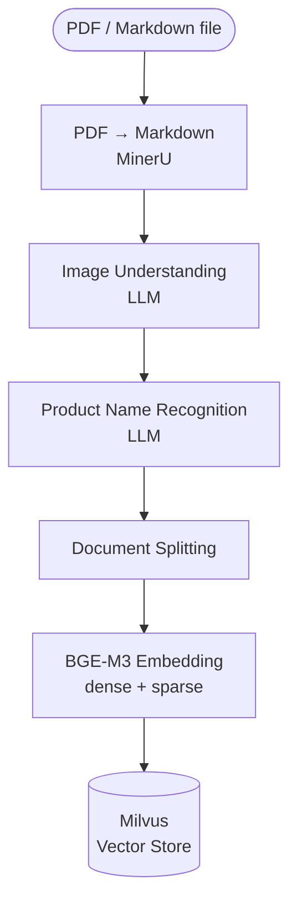
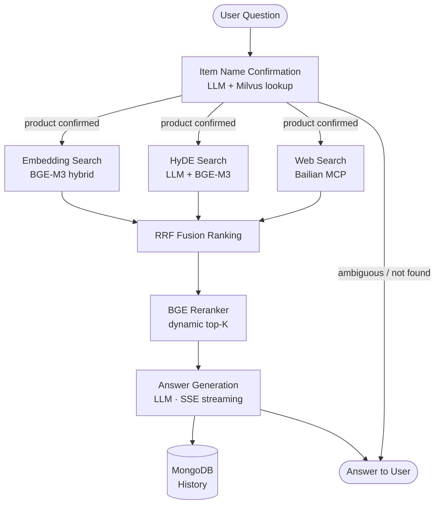

# Internal RAG System

An internal Retrieval-Augmented Generation (RAG) system built with LangGraph, Milvus, and FastAPI. It provides an end-to-end pipeline for importing product documents and answering user questions with accurate, context-grounded responses.

---

## Overview

The system is split into two independent pipelines:

| Pipeline | Purpose |
|---|---|
| **Import Pipeline** | Ingest PDF/Markdown documents → parse → chunk → embed → store in Milvus |
| **Query Pipeline** | Accept user questions → retrieve relevant chunks → rerank → generate answers |

Both pipelines are implemented as LangGraph state-machine graphs and exposed via a unified FastAPI service (`app/api/main_service.py`).

---

## Architecture

### Import Pipeline



### Query Pipeline



---

## Key Components

### Import Pipeline (`app/import_process/`)
- **node_pdf_to_md** — converts PDF documents to Markdown via MinerU
- **node_md_img** — uses an LLM to generate text descriptions for embedded images
- **node_item_name_recognition** — extracts product names from document content using an LLM
- **node_document_split** — splits Markdown into semantic chunks
- **node_bge_embedding** — generates BGE-M3 dense + sparse vectors for each chunk
- **node_import_milvus** — upserts chunks and vectors into Milvus
- **main_service** — Unified FastAPI service handling both import and query pipelines (port 8000)

### Query Pipeline (`app/query_process/`)
- **node_item_name_confirm** — resolves and confirms the product name from the user's question using LLM + vector similarity; handles ambiguous and out-of-catalogue queries
- **node_search_embedding** — standard BGE-M3 hybrid (dense + sparse) Milvus search
- **node_search_embedding_hyde** — HyDE retrieval: generates a hypothetical answer, embeds it, then searches — improves recall for short queries
- **node_web_search_mcp** — optional web search via Bailian MCP for supplemental results
- **node_rrf** — Reciprocal Rank Fusion merges results from all retrieval sources
- **node_rerank** — BGE reranker scores and dynamically truncates to the top-K most relevant chunks
- **node_answer_output** — assembles the final prompt and calls the LLM; supports SSE streaming
- **main_service** — Unified FastAPI service with SSE streaming and session history (port 8000)

### Infrastructure (`docker-compose.yml`)
| Service | Port | Purpose |
|---|---|---|
| Milvus standalone | 19530 | Vector database |
| etcd | 2379 | Milvus metadata store |
| MinIO | 9000 / 9001 | Object storage for Milvus segments |
| Attu | 8000 | Milvus GUI |
| MongoDB | 27017 | Conversation history |

---

## Tech Stack

| Layer | Technology |
|---|---|
| Orchestration | LangGraph |
| LLM / Embeddings | LangChain + OpenAI-compatible API |
| Embedding model | BAAI/bge-m3 (dense + sparse, local) |
| Reranker model | BAAI/bge-reranker-large (local) |
| Vector store | Milvus (standalone) |
| Document parsing | MinerU |
| Object storage | MinIO |
| History store | MongoDB |
| API | FastAPI + Uvicorn |
| Web search | Bailian MCP (SSE / Streamable HTTP) |

---

## Getting Started

### 1. Start infrastructure

```bash
docker compose up -d
```

### 2. Download models

```bash
# BGE-M3 embedding model
python -m app.tool.download_bgem3

# BGE reranker model
python -m app.tool.download_reranker
```

### 3. Configure environment

Copy `.env.example` to `.env` and fill in the required values:

```env
# LLM
LM_BASE_URL=
LM_API_KEY=
LM_MODEL=

# Milvus
MILVUS_URI=http://localhost:19530
CHUNKS_COLLECTION=kb_chunks
ITEM_NAME_COLLECTION=kb_item_names

# MongoDB
MONGO_URL=mongodb://127.0.0.1:27017
MONGO_DB_NAME=rag_chat_01

# MCP web search (optional)
BAILIAN_MCP_BASE_URL=
BAILIAN_API_KEY=
```

### 4. Run services

```bash
# Unified service (import + query pipelines on port 8000)
python -m app.api.main_service
```

- **Import UI:** `http://127.0.0.1:8000/import.html`
- **Chat UI:** `http://127.0.0.1:8000/chat.html`

---

## Project Structure

```
internal-rag-system/
├── app/
│   ├── api/              # Unified FastAPI service (main_service.py)
│   ├── clients/          # Milvus, MinIO, MongoDB clients
│   ├── conf/             # Configuration classes (LLM, embedding, reranker, etc.)
│   ├── core/             # Logger, prompt loader
│   ├── import_process/   # Document import pipeline
│   │   ├── agent/        # LangGraph nodes and graph definition
│   │   └── pages/        # Import UI (HTML)
│   ├── lm/               # LLM, embedding, reranker utilities
│   ├── query_process/    # Query pipeline
│   │   ├── agent/        # LangGraph nodes and graph definition
│   │   └── page/         # Chat UI (HTML)
│   ├── tool/             # Model download scripts
│   └── utils/            # Shared utilities (SSE, task tracking, etc.)
├── ai_models/            # Local model weights (gitignored)
├── prompts/              # Prompt templates
├── docker-compose.yml
└── pyproject.toml
```
